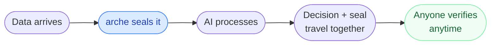

# Arche

> *Proof that AI saw what you think it saw.*

&nbsp;

Every tool in the AI audit space records what the model **decided**.  
No tool records whether the data the model saw was **real**.

That is the gap. arche closes it.

&nbsp;

## The gap nobody is talking about


Existing systems prove the **right side** of this diagram beautifully.  
The **left side**  whether what entered the AI was genuine, nobody proves.  
An attacker who silently manipulates the input before the AI sees it leaves no trace in any log, any audit trail, anywhere.

&nbsp;

## What arche does



One seal. Generated before the AI touches anything.  
It travels with the decision. It never expires.  
Anyone, a regulator, a court, another system, can verify it with nothing but the receipt and a public key. No access to the AI, the logs or the operator required.

If the input was changed before the AI saw it, the seal breaks. Always.

&nbsp;

## Get started

No pip. No dependencies. Clone and run.

```bash
git clone https://github.com/yourusername/arche.git
python example.py
```

&nbsp;

## Three functions

```python
from arche import seal, bind, verify

# step 1 — before the AI sees anything
s = seal(data="altitude=408km status=nominal")

# step 2 — after the AI decides
receipt = bind(seal=s, decision="no anomaly detected")

# step 3 — verify anytime, by anyone
result = verify(receipt=receipt, original_data="altitude=408km status=nominal")

print(result.valid)    # True
print(result.reason)   # "input matches seal, timestamp intact"
```

Change a single character in the original data. `result.valid` becomes `False`.  
That is the entire interface.

&nbsp;

## Where this matters

**AI agent pipelines**  
One agent feeds another. Seal every handoff. Make the entire chain auditable at every link.

**Space operations**  
The telemetry an AI anomaly detector acted on —> was it real? Prove it.

**Healthcare**  
The scan an AI diagnostic tool processed —> was it the right patient, unaltered? Prove it.

**Finance**  
The market data an algorithmic system acted on —> was it the genuine feed at that moment? Prove it.


&nbsp;

## How it works

arche takes a cryptographic fingerprint of raw input the moment it arrives. It seals that fingerprint with a timestamp from an external source the operator does not control, so nothing can be backdated. The seal binds to whatever decision follows. Verification reruns the fingerprint on the original data and checks it against the seal. Match means genuine. Mismatch means something changed.

Three functions. Under 150 lines. Standard library only.

&nbsp;

## What this is not

Not encryption. Not an audit log. Not a compliance platform.  
One primitive. One gap. Everything else builds on top.

&nbsp;

```
arche/
├── arche.py            the primitive
├── example.py          start here
├── example_space.py    satellite telemetry walkthrough
└── README.md
```

&nbsp;

MIT  use it, break it, build on it.
